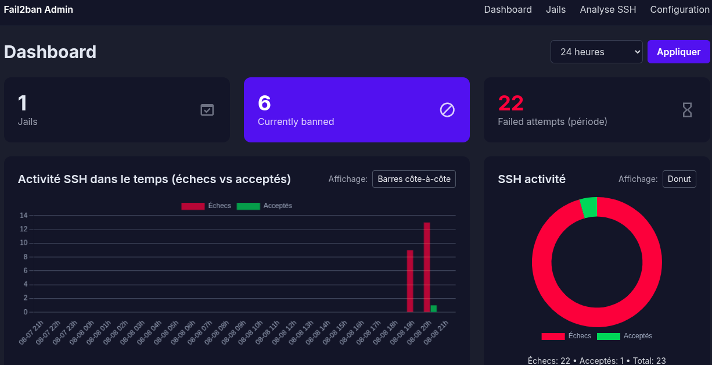

# Fail2ban Admin (Flask)


Application web Flask pour administrer Fail2ban de façon simple et sécurisée.

Fonctionnalités principales:
- Dashboard : Vue d'ensemble des menaces
- SSH : Analyse des connexions ssh
- Gestion IPs : Bannir/débannir facilement
- Cartes géographiques : Voir d'où viennent les attaques
- Configuration : Modifier les paramètres des jails
- Logs : Analyser l'activité de sécurité
- Authentification: login/logout


## Installation 
- Pré‑requis: Python 3.10+.
- python-pip, python-venv, fail2ban 

# Télécharger les fichiers
```
git clone https://github.com/anis-metref/fail2ban-flask.git
cd fail2ban-flask
```

```
python3 -m venv .venv
source .venv/bin/activate  # Windows: .venv\Scripts\activate
pip install -r requirements.txt
```

Copier le fichier .env.example pour ajuster certains paramètres.

```
cp .env.example  .env
```
## Variables d’environnement
- FLASK_SECRET_KEY=change-me
- F2B_CMD=fail2ban-client    #chemin de fail2ban-client
- F2B_SUDO=1                 #pour préfixer par sudo -n
- SSH_SUDO=1                 #pour `journalctl` via sudo -n
- F2B_DEFAULTS_FILE=/etc/fail2ban/jail.d/99-ui.conf   #fichier de conf de fail2ban


 Créer le fichier :
   ```bash
   sudo touch /etc/fail2ban/jail.d/99-ui.conf
   ```
 Ajouter :
   ```ini
   [sshd]
   enabled = true
   ```
 **Remarque** :  
   Si un autre fichier `jail` configure déjà `[sshd]`, pense à le **désactiver** pour que celui-ci soit pris en compte.


## Lancement
```
python3 app.py
```

Ouvrir: 'http://localhost:5000/login'
- Identifiants: **admin** / **admin**
- Après connexion, allez dans Profil pour changer le mot de passe.


